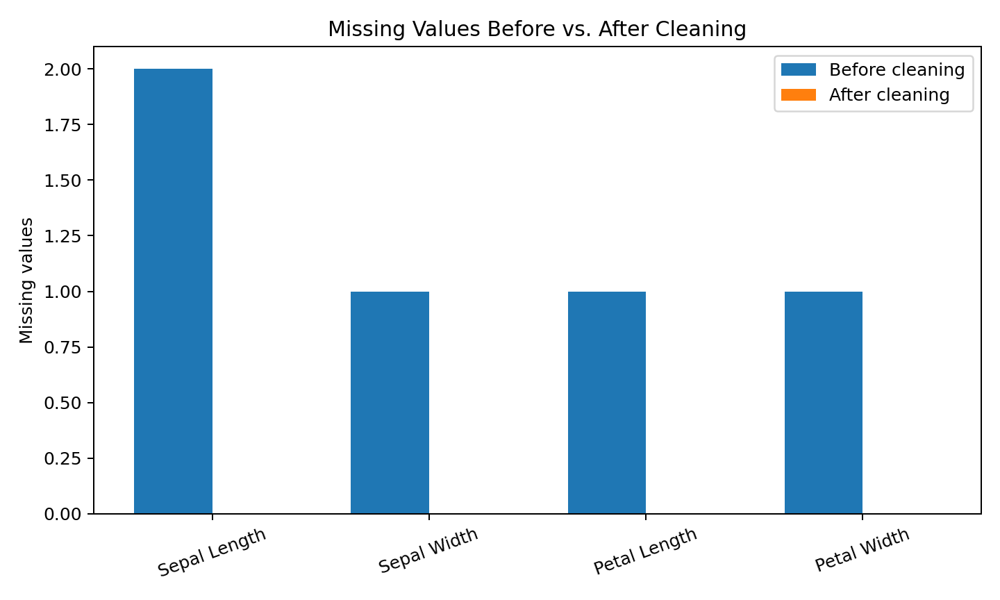
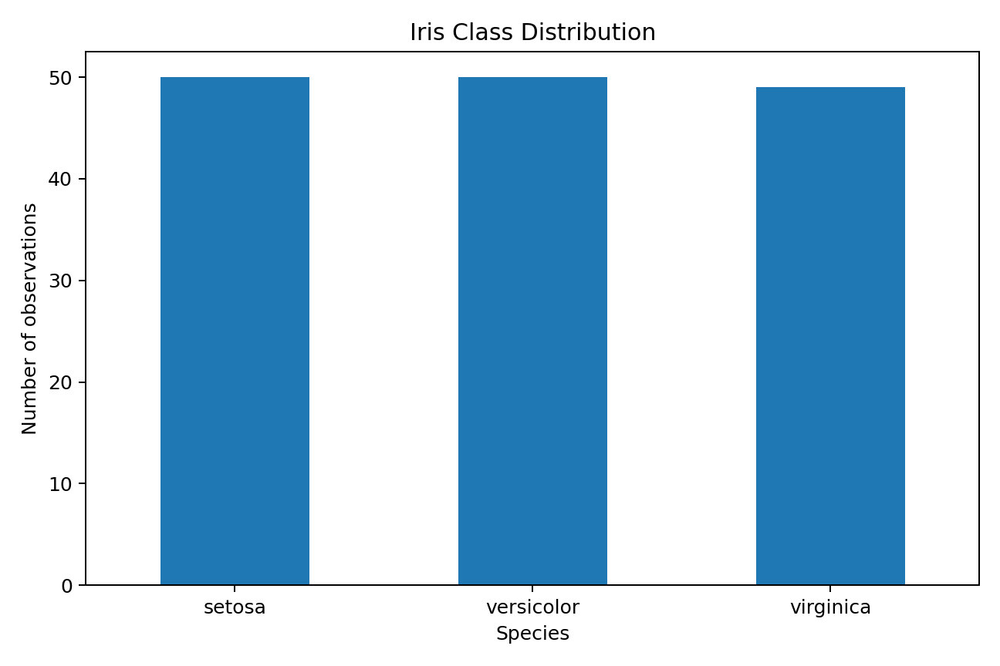
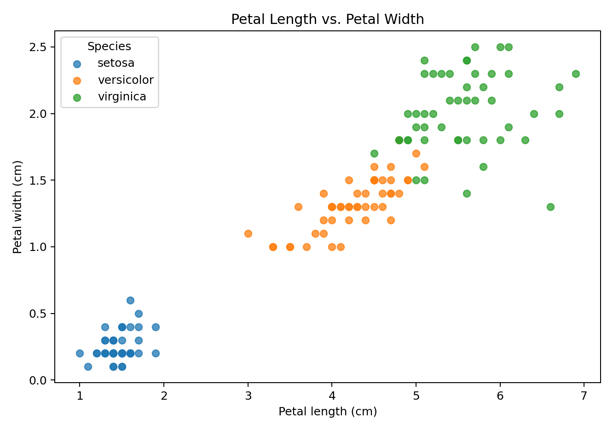
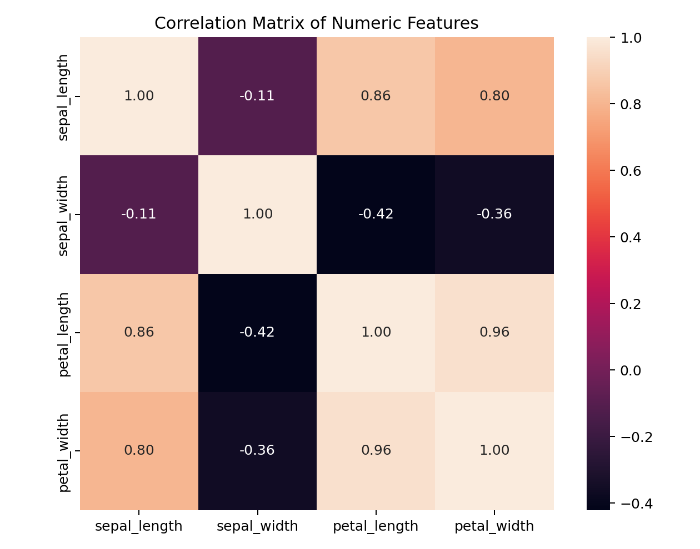

# Week 1 — Data Acquisition, Cleaning & Exploratory Data Analysis


## 📌 Project Overview

This repository contains my **Week 1 Data Science Internship project**, focused on the fundamental stages of a data science workflow:

- Public dataset acquisition
- Data inspection and quality assessment
- Missing-value handling
- Duplicate detection and removal
- Data-type correction
- Data preprocessing
- Descriptive statistics
- Exploratory Data Analysis (EDA)
- Data visualization
- Documentation and reproducibility

The project uses the **Iris dataset**, a publicly available dataset from the **UCI Machine Learning Repository**.

---

## 🎯 Objectives

The main objectives of this project are to:

1. Acquire a publicly available dataset.
2. Understand the structure and characteristics of the data.
3. Identify potential data-quality issues.
4. Apply appropriate data-cleaning techniques.
5. Perform exploratory analysis using Python.
6. Create meaningful visualizations.
7. Identify important patterns and relationships.
8. Document the complete workflow in a reproducible manner.

---

## 📊 Dataset

### Iris Dataset

**Source:** UCI Machine Learning Repository  
**Dataset ID:** 53  
**Official Source:** https://archive.ics.uci.edu/dataset/53/iris

The Iris dataset contains measurements of flowers belonging to three Iris species.

### Features

| Feature | Description | Data Type |
|---|---|---|
| `sepal_length` | Sepal length in centimeters | Numerical |
| `sepal_width` | Sepal width in centimeters | Numerical |
| `petal_length` | Petal length in centimeters | Numerical |
| `petal_width` | Petal width in centimeters | Numerical |
| `species` | Iris flower species | Categorical |

The original dataset contains **150 observations** distributed across three species.

### Species

- Iris Setosa
- Iris Versicolor
- Iris Virginica

> **Important note:** The original UCI Iris dataset does not contain missing values. To demonstrate the data-cleaning techniques required for this internship task, a working copy was created with five controlled missing numerical values and three intentionally added duplicate records. These simulated issues are clearly identified in the analysis code and report.

---

## 🛠️ Technologies Used

- **Python 3.10+**
- **Pandas** — data manipulation and preprocessing
- **NumPy** — numerical operations
- **Matplotlib** — data visualization
- **Seaborn** — statistical visualization
- **Scikit-learn** — dataset loading and data-science utilities

---

## 📁 Project Structure

```text
week1-iris-data-analysis/
│
├── data/
│   ├── raw/
│   │   └── README.md
│   └── processed/
│       └── iris_cleaned.csv
│
├── notebooks/
│   └──  notebooks/Week_1_Iris_Data_Acquisition_Cleaning_EDA_FINAL.ipynb
│
├── src/
│   └── week1_eda.py
│
├── reports/
│   └── figures/
│       ├── 01_missing_values.png
│       ├── 02_class_distribution.png
│       ├── 03_petal_scatter.png
│       └── 04_correlation_heatmap.png
│
├── docs/
│   └── Week_1_Data_Acquisition_Cleaning_EDA_Report.docx
│
├── requirements.txt
├── PROJECT_INFO.md
├── LICENSE
├── .gitignore
└── README.md
```

---

## 🔄 Data Science Workflow

```text
Public Dataset
      ↓
Data Acquisition
      ↓
Data Inspection
      ↓
Data Quality Assessment
      ↓
Data Cleaning
      ↓
Data Type Standardization
      ↓
Exploratory Data Analysis
      ↓
Visualization
      ↓
Insights & Interpretation
      ↓
Cleaned Dataset
```

---

## 🧹 Data Cleaning

### 1. Missing Values

Five controlled missing values were introduced into numerical columns for demonstration purposes.

The missing values were handled using **median imputation**:

```python
for column in numeric_cols:
    df[column] = pd.to_numeric(
        df[column],
        errors="coerce"
    )

    df[column] = df[column].fillna(
        df[column].median()
    )
```

### Why Median Imputation?

The median is less affected by unusually large or small observations than the mean and allows the existing observations to be retained.

### 2. Duplicate Records

Duplicate records were identified using:

```python
df.duplicated().sum()
```

They were removed using:

```python
df = df.drop_duplicates()
```

Removing duplicates prevents repeated observations from having disproportionate influence on descriptive statistics and future models.

### 3. Data Types

Numerical measurements were converted to numeric data types, while the species variable was converted to a categorical type:

```python
df["species"] = df["species"].astype("category")
```

---

## 📈 Exploratory Data Analysis

The cleaned dataset was explored using descriptive statistics and four visualizations.

### Visualization 1 — Missing Values



This visualization compares missing values before and after preprocessing. The simulated missing values are removed after median imputation.

### Visualization 2 — Class Distribution



The original Iris dataset contains three species with balanced representation, with 50 observations per species.

### Visualization 3 — Petal Length vs Petal Width



The scatter plot shows the relationship between petal length and petal width. Setosa is visually separated from the other species, while Versicolor and Virginica show greater overlap.

### Visualization 4 — Correlation Heatmap



The correlation matrix illustrates relationships between the numerical features. The petal measurements show particularly strong positive correlation.

---

## 🔍 Key Findings

- The dataset contains three balanced Iris species.
- Petal measurements have strong relationships with each other.
- Petal length and petal width provide useful visual separation between species.
- Setosa is particularly distinct from Versicolor and Virginica using petal measurements.
- Versicolor and Virginica have greater overlap and may require multiple features for classification.
- The cleaning pipeline successfully handles the simulated missing values and duplicate records.
- Correlated features should be considered carefully during future predictive modeling.

---

## ▶️ Installation

Clone the repository:

```bash
git clone https://github.com/Vikas-Yadav-6696/week1-iris-data-analysis.git
```

Move into the project directory:

```bash
cd week1-iris-data-analysis
```

Create a virtual environment:

```bash
python -m venv .venv
```

### Windows

```bash
.venv\Scripts\activate
```

### macOS / Linux

```bash
source .venv/bin/activate
```

Install dependencies:

```bash
pip install -r requirements.txt
```

---

## ▶️ Running the Project

Run the main analysis script:

```bash
python src/week1_eda.py
```

The script:

1. Loads the Iris dataset.
2. Standardizes column names.
3. Creates a working dataset.
4. Introduces controlled missing values for cleaning demonstration.
5. Introduces controlled duplicate records.
6. Checks missing values and duplicates.
7. Performs median imputation.
8. Removes duplicates.
9. Corrects data types.
10. Calculates descriptive statistics.
11. Generates four visualizations.
12. Saves the cleaned dataset.

---

## 📂 Output Files

### Cleaned Dataset

```text
data/processed/iris_cleaned.csv
```

### Visualizations

```text
reports/figures/01_missing_values.png
reports/figures/02_class_distribution.png
reports/figures/03_petal_scatter.png
reports/figures/04_correlation_heatmap.png
```

### Project Report

```text
docs/Week_1_Data_Acquisition_Cleaning_EDA_Report.docx
```

---

## 🚀 Future Scope

The cleaned dataset can be used for further machine-learning experiments, including:

- Logistic Regression
- K-Nearest Neighbors
- Decision Tree Classification
- Support Vector Machines
- Feature Scaling
- Principal Component Analysis (PCA)
- Cross-Validation
- Confusion Matrix Analysis
- Precision, Recall and F1-Score
- Model Comparison

---

## 📄 Project Report

The complete documentation is available in:

**[Week 1 Data Acquisition, Cleaning & EDA Report](docs/Week_1_Data_Acquisition_Cleaning_EDA_Report.docx)**

The report contains dataset information, acquisition methodology, cleaning methodology, Python code, summary statistics, visualizations, EDA findings, and recommendations for further analysis.

---

## 👨‍💻 Author

**Vikas Yadav**

Data Science Internship — Week 1

GitHub:  
https://github.com/Vikas-Yadav-6696

Repository:  
https://github.com/Vikas-Yadav-6696/week1-iris-data-analysis

---

## 📚 References

1. UCI Machine Learning Repository — Iris Dataset  
   https://archive.ics.uci.edu/dataset/53/iris

2. Fisher, R. A. (1936). *The use of multiple measurements in taxonomic problems*. Annals of Eugenics, 7(2), 179–188.

3. Pedregosa et al. (2011). *Scikit-learn: Machine Learning in Python*. Journal of Machine Learning Research, 12, 2825–2830.

---

## 📌 Project Status

**Status:** Completed ✅

**Project Type:** Data Science / Exploratory Data Analysis

**Internship Week:** Week 1

**Primary Language:** Python
